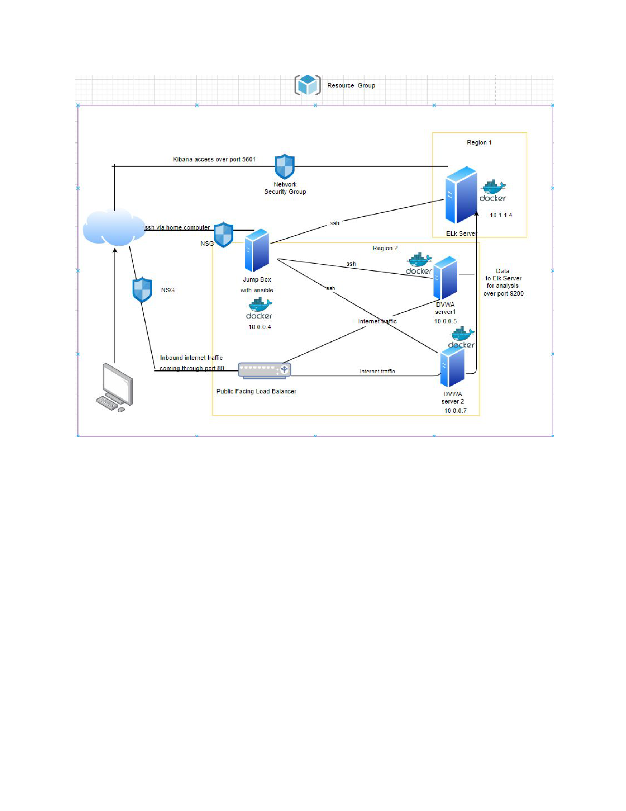

## Automated ELK Stack Deployment

The files in this repository were used to configure the network depicted below.

These files have been tested and used to generate a live ELK deployment on Azure. They can be used to either recreate the entire deployment pictured above. Alternatively, select portions of the ansible file may be used to install only certain pieces of it, such as Filebeat.

###  Enter the playbook file._  filebeat-playbook.yml

This document contains the following details:
- Description of the Topologu
- Access Policies
- ELK Configuration
- Beats in Use
- Machines Being Monitored
- How to Use the Ansible Build

### Description of the Topology

The main purpose of this network is to expose a load-balanced and monitored instance of DVWA, the D*mn Vulnerable Web Application.

Load balancing ensures that the application will be highly redundant, in addition to restricting access to the network.
	What aspect of security do load balancers protect? 
         LB is evenly distributing traffic amoungst multiple severs, preventing either a natural DOS or malicious DOS 

	    What is the advantage of a jump box?_
        Single entry point into the other VM's, reducing the attack surface

Integrating an ELK server allows users to easily monitor the vulnerable VMs for changes to the logs and system metrics.

 What does Filebeat watch for? Monitor logs to look for changes in the log files
 What does Metricbeat record? Collects machine metrics, such as
 uptime, cpu usage 

The configuration details of each machine may be found below.
_Note: Use the [Markdown Table Generator](http://www.tablesgenerator.com/markdown_tables) to add/remove values from the table_.

| Name      | Function           | IP Address      | Operating System |
|---------- |----------          |------------     |------------------|
| Jump Box  | Gateway            | 10.0.0.4        | Linux            |
| Elk       | Monitoring         | 10.1.1.4        | Linux            |
| DVWA1     | WEb App            | 10.0.0.5        | Linux            |
| DVWA2     | WEb app            | 10.0.0.7        | Linux            |

### Access Policies

The machines on the internal network are not exposed to the public Internet. 

Only the RedTeam machine can accept connections from the Internet. Access to this machine is only allowed from the following IP addresses
### Add whitelisted IP addresses_108.6.64.226

Machines within the network can only be accessed by Jump Box____.
### Which machine did you allow to access your ELK VM? What was its IP address?_MY HOME COMPUTER 108.6.64.226

A summary of the access policies in place can be found in the table below.

| Name        | Publicly Accessible    | Allowed IP Addresses |
|----------   |---------------------   |----------------------
|Jump Box     | Yes                    |  108.6.64.226        
|Elk          | Yes                    |  108.6.64.226 ,104.42.64.19,104.42.14.57 
|DVWA1        | No                     |  10.0.0.4                               
|DVWA2        | No                     |  10.0.0.4            

### Elk Configuration

Ansible was used to automate configuration of the ELK machine. No configuration was performed manually, which is advantageous because...
### What is the main advantage of automating configuration with Ansible?_
    Repeatable or reproducable results, allowing constitency across configuration
    Streamlines IAC

### The playbook implements the following tasks:
 - ...SSH into Jump Box and installed Docker io
- ...Pull ansible container, start and attach the container
  ...create the install elk playbook
  ...Add elk IP to host file, and run the playbook
The following screenshot displays the result of running `docker ps` after successfully configuring the ELK instance.

### Target Machines & Beats
This ELK server is configured to monitor the following machines:
### List the IP addresses of the machines you are monitoring_
10.0.0.5 10.0.0.7

We have installed the following Beats on these machines:
### Specify which Beats you successfully installed_
File Beat
Metric Beat

### These Beats allow us to collect the following information from each machine:
file beat-
Monitor logs to look for changes in the log files
Metric beat-
Collects machine metrics, such as
 uptime, cpu usage 
### Using the Playbook
In order to use the playbook, you will need to have an Ansible control node already configured. Assuming you have such a control node provisioned: 

SSH into the control node and follow the steps below:
- Copy the playbook file to ansible playbook directory.
- Update the hosts file to include neccessary IP
- Run the playbook, and navigate to local host to check that the installation worked as expected.

_
- _Which file is the playbook? Where do you copy it?_
ansible playbook filebeat playbook metricbeat playbook elk playbook

- _Which file do you update to make Ansible run the playbook on a specific machine? 
hosts file

 How do I specify which machine to install the ELK server on versus which to install Filebeat on?_
  Differantiate between elkserver and webservers when specify IP adresses in  hosts file 

- _Which URL do you navigate to in order to check that the ELK server is running?
    the public IP adresses of elk server in browser on locl machine over port 5601

_As a **Bonus**, provide the specific commands the user will need to run to download the playbook, update the files, etc._###
 ansible-playbook <playbook name> 
